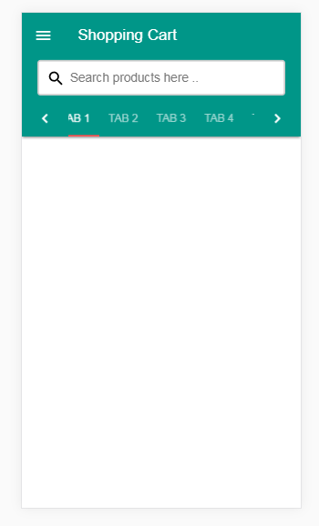
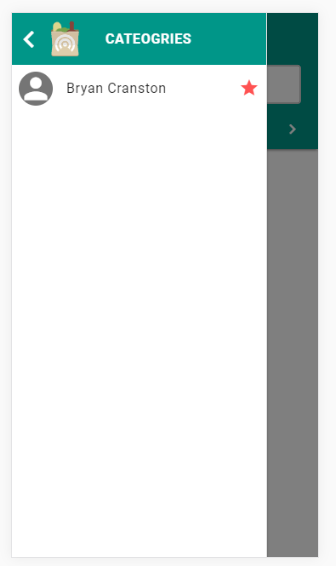

# Angular-practice-apps
This repository  contains all angular- 5 apps
# 1.  Angular5-recipeBook.zip
This is completed Recipebook-App exercise from the course guided by Maximilian Schwarzmüller Angular 5 (formerly Angular 2) - The Complete Guide.  
App has been hosted in heroku:   https://ang-recipe.herokuapp.com/
 [ steps to execute ] :
 1. Download Angular5-recipeBook.zip extract it.
 2. Naviagate inside folder execute command npm run install to install all dependency after installing all  dependency execute ng serve in terminal.
 3. visit http://localhost:4200/ to see runing app.

# 2. Angular animation-part1.zip
This exercise uses Angular animation package for implemnting animation in angular app.
 [ steps to execute ] :
  Refer above steps.

# 3. Custom Filter [Countries list filter app with Progress bar]
This exercise shows the uses custom filter. 

# 4. Material Design lite:
Sample implementaion for the material design lite in web. 
 &nbsp;&nbsp;

# 5. Github search:
GitHub_search angular Implementation, Cross component communication.
